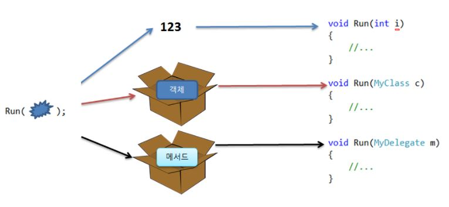

# 대리자

## 기본 개요
> **대리자**는 특정 매개 변수 목록 및 반환 형식이 있는 메서드에 대한 참조를 나타내는 형식으로, 대리자를 인스턴스화하면 모든 메서드가 있는 인스턴스를 호환되는 시그니처 및 반환 형식에 연결할 수 있다. 

> **대리자는 메서드를 다른 메서드에 인수로 전달하는 데 사용된다.**
> \
> 위의 그림과 같이, 숫자 혹은 객체를 메서드의 파라미터로 전달할 수 있듯이, 메서드 또한 파라미터로 전달할 수 있다. 
> 
> (*복수개의 메서드들도 전달 가능*)
> 
> 이와 더불어 메서드의 리턴값으로 호출자에게 전달이 가능하다. 
> 
## 대리자 선언 예시
```cs
void Run(MyDelegate method){...}
// 대리자 정의
delegate int MyDelegate(string s);
```
> 여기서 MyDelegate가 대리자 타입이라면, 이 함수는 다른 어떤 메서드를 Run() 메서드에 전달하고 있는 것이다. 
> 
> **delegate 정의에서 중요한 것은 입력 파라미터들과 리턴 타입**
> 
> 메서드와 대리자의 입력 파라미터 타입 및 갯수, 리턴 타입이 동일하다면 그 메서드를 해당 대리자에서 사용될 수 있다.
> 대리자가 이렇게 정의된 후에는 클래스 객체를 생성한 것과 비슷한 방식으로 new를 써서 대리자 객체를 생성한다. 
```cs
// int StringToInt(string s){ ... }

MyDelegate m = new MyDelegate(StringToInt);
Run(m);

```
> 전달된 대리자로부터 실제 메서드를 호출하는 것은 대리자 객체의 .Invoke() 메서드나 .BeginInvoke() 메서드를 써서 호출한다. 예를 들어, m 이라는 대리자 객체를 전달 받았을 경우, 아래와 같이 Invoke()를 사용하여 호출한다.
```cs
i = m.Invoke("123");
// 아래는 위와 상동하다.
i = m("123");
```
```cs
 public delegate int PerformCalculation(int x, int y);
```
> 액세스 가능한 클래스 또는 대리자 형식과 일지하는 구조의 모든 메서드는 대리자에 할당 가능하며, 메서드는 정적 메서드이거나 인스턴스 메서드일 수 있습니다. 

## 대리자 속성
* 대리자는 C++ 함수 포인터와 유사하지만 이와 달리 멤버 함수에 대해 완전히 개체 지향이며 개체 인스턴스 및 메서드를 모두 캡슐화한다. 

*캡슐화는 public, protected, private와 괕이 일반적으로 연관 있는 변수와 함수를 클래스로 묶는 작업*

* 여러 대리자를 연결할 수 있다.
* 메서드는 대리자 형식과 정확히 일치하지 않아도 되며, 람다 식 사용을 통해 코드 블록 작성을 더욱 간단히 할 수 있다. 

## 대리자 사용 가이드
**대리자를 메서드 파라미터로 전달**
> 대리자는 동일한 함수 프로토타입을 갖는 메서드를 가리키므로 함수의 포인터를 파라미터로 전달하듯, 다른 함수의 파라미터로 사용될 수 있다. 대리자 파라미터를 전달받은 쪽은 이를 자신의 내부 함수를 호출하듯 사용할 수 있다. 

> 아래의 예제는 올림차순으로 비교하는 함수와 내림차순으로 비교하는 함수를 대리자로 전달하여, 하나의 Sort() 메서드에 전달된 대리자 비교함수에 따라 여러 방식으로 소트가 가능하다는 것을 보여주는 예이다. 
```cs
using System;
using System.Collections.Generic;
using System.Linq;
using System.Text;
using System.Threading.Tasks;
using System.ComponentModel;

namespace delegateEx1
{
    class MySort
    {
        public delegate int CompareDelegate(int i1, int i2);
        
        public static void Sort(int[] arr, CompareDelegate comp)
        {
            if (arr.Length < 2) return;
            Console.WriteLine("함수 Prototype: " + comp.Method);

            int ret;
            for(int i = 0; i < arr.Length - 1; i++)
            {
                for(int j = i + 1; j < arr.Length; j++)
                {
                    ret = comp(arr[i], arr[j]);
                    if(ret == -1)
                    {
                        int tmp = arr[j];
                        arr[j] = arr[i];
                        arr[i] = tmp;
                    }
                }
            }
            Display(arr);
        }
        static void Display(int[] arr)
        {
            foreach (var i in arr) Console.Write(i + " ");
            Console.WriteLine();
        }
    }
    class Program
    {
        static void Main(string[] args)
        {
            (new Program()).Run();
        }
        void Run()
        {
            int[] a = { 5, 10, 23, 49, 102, 88, 3, 2 };

            MySort.CompareDelegate compDelegate = AscendingCompare;
            MySort.Sort(a, compDelegate);

            compDelegate = DescendingCompare;
            MySort.Sort(a, compDelegate);
        }
        int AscendingCompare(int i1, int i2)
        {
            if (i1 == i2) return 0;
            return (i2 - i1) > 0 ? 1 : -1;
        }
        int DescendingCompare(int i1, int i2)
        {
            if (i1 == i2) return 0;
            return (i1 - i2) > 0 ? 1 : -11;
        }
    }
}
```

```cs
public delegate void Del(string message);
```
> 위의 예제에서는 string을 인수로하고 void를 반환하는 메서드를 캡슐화하는 **Del** 대리자를 선언합니다. 
> 대리자 개체는 일반적으로 대리자가 래핑할 메서드의 이름으로 제공하거나 익명 함수를 사용하여 생성합니다. 대리자를 인스턴스화하고 나면 대리자에 대한 메서드 호출이 대리자에 의해 해당 메서드로 전달됩니다. 
>호출자가 대리자에게 전달한 매개 변수가 메서드로 전달되며 메서드의 반환 값이 있는 경우에 대리자에 의해 호출자로 반환되며 이 과정을 관리자 호출이라고 합니다. 
```cs
// 대리자를 위한 메서드 생성
public static void DelegateMethod(string message)
{
    Console.WriteLine(message);
}
// 대리자 인스턴스화
Del handler = DelegateMethod;
// 대리자 호출
handler("Hello world");
```

> 콜백은 사용자 지정 비교 메서드를 정의하고 해당 대리자를 정렬 메서드로 전달할 떄도 일반적으로 사용됩니다. 이 경우 호출자의 코드를 정렬 알고리즘의 일부분으로 포함할 수 있습니다. 
```cs
// Del 형식 매개 변수 사용
public static void MethodWithCallback(int param1, int param2, Del callback)
{
    callback("The number is: " + (param1 + param2).ToString());
}
// 해당 메서드로 대리자 전달
MethodWithCallback(1, 2, handler);

// -------------- Console Output
// The number is : 3
// -----------------------------

```
> 대리자는 명명된 메서드에 연결할 수 있으며, 이를 사용하여 대리자를 인스턴스화하면 메서드가 매개 변수로 전달됩니다.
```cs
// 대리자 선언
delegate void Del(int x);

// 명명된 메서드 정의
void DoWork(int k){ /*......*/};

// 인스턴스화된 대리자를 메서드의 파라미터로 사용
Del d = boj.DoWork;
```

```cs
// 대리자 선언
delegate void Del(int i, double j);

class Mathclass
{
    static void Main()
    {
        MathClass m = new MathClass();
        // 함수를 사용하여 대리자 인스턴스화 
        Del d = m.MultiplyNumbers;
        
        Console.WriteLine("Invoking the delegate using 'MultiplyNumbers':");
        for(int i = 1; i <= 5; i++) d(i, 2);
        Console.WriteLine("Enter To Exit");
        Console.ReadKey();
    }
    
    void MultiPlyNumbers(int m, int n)
    {
        Console.Write(m * n + " ");
    }
}
```
> 한 대리자가 정적 메서드와 인스턴스 메서드 모두에 매핑되어 각각의 특정 정보를 반환
```cs
delegate void Del();

class SampleClass
{
    public void InstanceMethod()
    {
      Console.WriteLine("A message from the instance method.");
    }
    
    static public void StaticMethod()
    {
      Console.WriteLine("A message from the static method.");
    }
class TestCampleClass
{
    static void Main()
    {
        var sc = new SampleClass();
        // 대리자를 인스턴스 메서드에 매핑
        Del d = sc.InstanceMethod;
        d();
        // 스태틱 메서드에 매핑
        d = SampleClass.StaticMethod;
        d();
    }
}
}

// ------------------ Console Output
// A message from the instance method.
// A messafe from the static method.
// ---------------------------------


```


