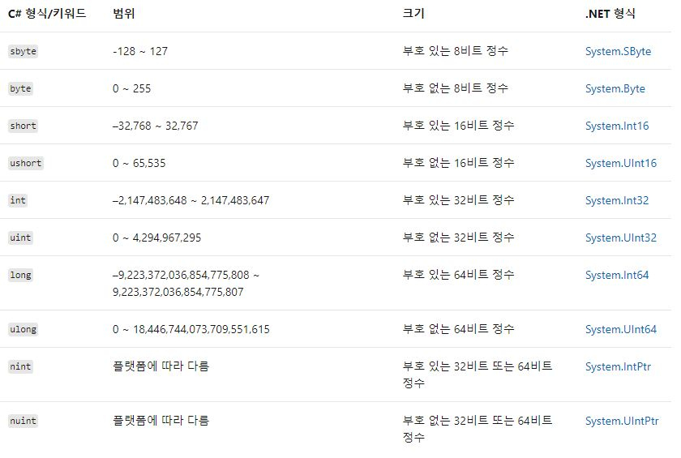

## Keyword
### 개요
> C#에서 사용되는 키워드, 연산자, 특수 문자, 지시문과 C# 언어에서의 특징을 정리한다. 

### 정수 
* 정수 형식



> 마지막 두 개를 제외한 모든 형식은 키워드와 .NET 형식 이름은 서로 바꿔 사용할 수 있다.
> 예를 들어, 아래와 같은 선언은 동일한 형식이다.
```cs
int a = 10;
System.Int32 b = 10;
```
* 정수 리터럴
> 정수 리터럴은 다음과 같은 규칙이 있다.
> 1. 10진수: 접두사가 없음
> 2. 16진수: 0x 또는 0X 접두사 사용
> 3. 이진수: 0b 또는 0B 접두사 사용

### 부동 소수점


