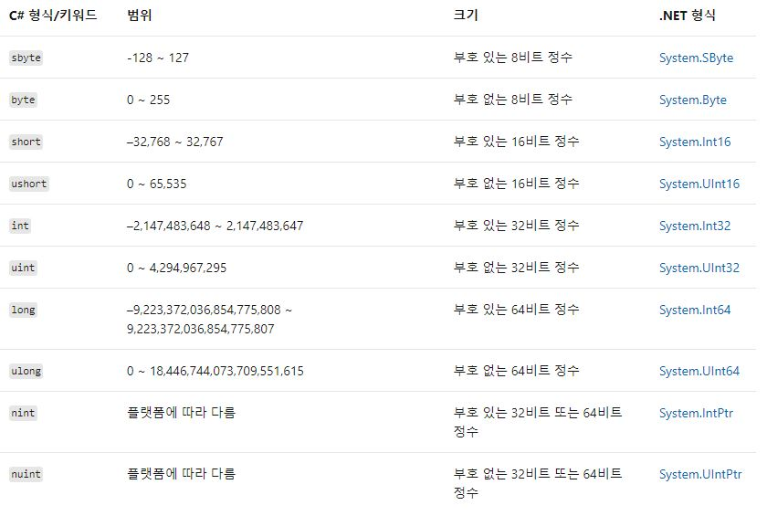
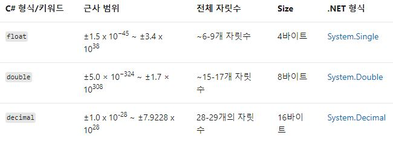

## Specification
### 개요
> C#에서 사용되는 키워드, 연산자, 특수 문자, 지시문과 C# 언어에서의 특징을 정리한다. 

### 정수 
* 정수 형식



> 마지막 두 개를 제외한 모든 형식은 키워드와 .NET 형식 이름은 서로 바꿔 사용할 수 있다.
> 예를 들어, 아래와 같은 선언은 동일한 형식이다.
```cs
int a = 10;
System.Int32 b = 10;
```
* 정수 리터럴
> 정수 리터럴은 다음과 같은 규칙이 있다.
> 1. 10진수: 접두사가 없음
> 2. 16진수: 0x 또는 0X 접두사 사용
> 3. 이진수: 0b 또는 0B 접두사 사용

### 부동 소수점



> 전체 자릿수를 소수점 이하 자릿수에 따라 결정하는 경우에는 decimal 형식이 적합하다. 이와 더불어, 0.1은 decimal 인스턴스로 정확하게 표현될 수 있지만, 0.1을 정확하게 표현하는 double 또는 float 인스턴스는 없으며, double과 float에서는 예기치 않은 반올림 오류가 발생할 수 있다. 하지만 decimal의 경우 차지하는 크기가 크기 때문에 최적화된 프로그램 개발을 위해선 double을 사용할 수 있다. 

### 특수 문자
* $ - 문자열 보간
> $ 특수 문자는 문자열 리터럴을 보간된 문자열로 실벽한다. 문자열 보간의 특징은 문자열 합성 서식 지정 기능보다 읽기 쉽고 편리하게 서식이 지정된 문자열을 만들 수 있다. 
```cs
string name = "Mark";
var date = DateTime.Now;

// Composite Formatting
Console.WriteLine("Hello, {0}! It's {1:HH:MM} on {2}.", name, date, date.DateOfWeek);
// String Interpolation
Console.WriteLine($"Hello, {name}! It's {date:HH:MM} on {date.DayOfWeek}.");

// -------------------------- Console Output
//  Hello, Mark! It's 09:24 on Monday.
//  Hello, Mark! It's 09:24 on Monday.
// -----------------------------------------

```
* @ - 축자 식별자
> @ 특수 문자는 축자 식별자로 사용되며, 다음과 같은 방법으로 활용될 수 있다. 
```cs
string[] @for = {"John", "James", "Jay"};
for(int ctr = 0; ctr < @for.Length; ctr++)
{
    Cnosole.WriteLine($"Hey, {@for[ctr]}!");
}

// ------------------- Console Outut
// Hey, John
// Hey, James
// Hey, Jay
// ----------------------------------
```


