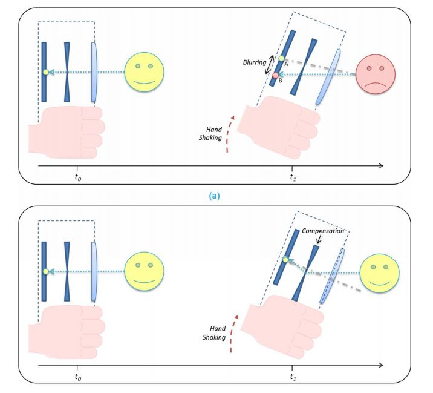

## OIS - Optical Image Stabilization, 광학적 영상 흔들림 방지 기술
### OIS란?
> OIS는 광학적 영상 흔들림 방지의 약어로, 카메라와 같은 광학장비의 흔들림 및 진동에 의한 영상의 흔들림을 최소화하는 기술이다. OIS 기술은 장비의 진동을 감지하고 이를 보상하는 방식으로 손 떨림 현상으로 인한 영상의 흔들림을 최소화한다. OIS 기술의 최소화된 영상의 흔들림을 바탕으로 긴 노출 시간을 얻을 수 있고 이는 실내 및 빛이 적은 환경에서 깔끔한 이미지를 얻을 수 있다는 장점이 있다. 

### OIS의 원리 및 특징
> OIS의 경우 DIS와는 대조적으로 후처리 알고리즘이 필요하지 않다. OIS는 카메라의 내부 장비 제어를 통해 광학 거리를 조절하여, 이미지 센서까지 도달하는 광원의 궤도가 일정하도록 유지한다. 

## OIS 렌즈 채결기
### OIS 렌즈 채결기란?
> ------------------------------------------------------------------------------

### 구성 요소
**통신**
* 시리얼 통신
>
* LAN
>
* PCI-Express
>
* EhterCAT
**센서 및 컨트롤러**
* 높이 측정 센서
* Piezo 컨트롤러
* Handler-Vision I/F
* 면각도 컨트롤러
* 터치 모니터
* SiC Drive Key
* Actuater 보드

