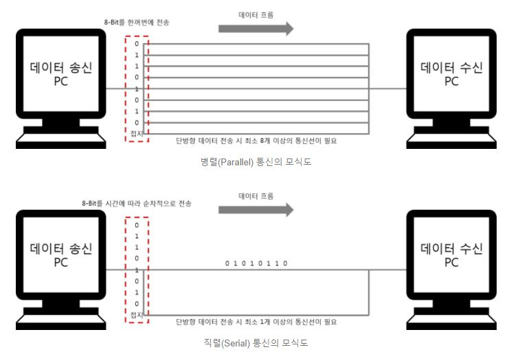

## OIS - Optical Image Stabilization, 광학적 영상 흔들림 방지 기술
### OIS란?
> OIS는 광학적 영상 흔들림 방지의 약어로, 카메라와 같은 광학장비의 흔들림 및 진동에 의한 영상의 흔들림을 최소화하는 기술이다. OIS 기술은 장비의 진동을 감지하고 이를 보상하는 방식으로 손 떨림 현상으로 인한 영상의 흔들림을 최소화한다. OIS 기술의 최소화된 영상의 흔들림을 바탕으로 긴 노출 시간을 얻을 수 있고 이는 실내 및 빛이 적은 환경에서 깔끔한 이미지를 얻을 수 있다는 장점이 있다. 

### OIS의 원리 및 특징
> OIS의 경우 DIS와는 대조적으로 후처리 알고리즘이 필요하지 않다. OIS는 카메라의 내부 장비 제어를 통해 광학 거리를 조절하여, 이미지 센서까지 도달하는 광원의 궤도가 일정하도록 유지한다. 
> 

## OIS 렌즈 채결기
### OIS 렌즈 채결기란?
> ------------------------------------------------------------------------------

### 구성 요소
**통신**
* 시리얼 통신
>
> 시리얼 통신은 말 그대로, 직렬 통신으로 대게 하나의 신호 라인을 통해 데이터를 주고 받는 통신이다. 하나의 라인으로 통신한다는 점에서 일정한 길이의 데이터를 전송하는 데, 다소 시간이 소요되지만, 경제적이며 안정적인 통신이 가능하다. 시리얼 통신의 예로는 USB, COM Port 등이 있다. 시리얼 통신의 방식으로는 동기와 비동기 방식이 있다. 
> 동기 통신의 경우 데이터라인과 더불어 동기 클록 라인이 있다는 점이다. 동기 클록을 통해 전송되는 데이터의 정보를 파악할 수 있고 적은 오류와 빠른 데이터 통신의 이점이 있지만, 비용의 증가라는 단점을 갖고있다. 비동기 통신의 경우 데이터 통신라인과 제어선으로만 구성이된다. 

> **시리얼 통신 종류**
> *RS-232* 
> *RS-422*
> *RS-485*
> *SPI*
> *I2C*
> *CAN*

* LAN
>
* PCI-Express
>
* EhterCAT
> 이더캣은 이더넷 기반의 필드버스 시스템으로 자동화 기술 측면에서 실시간 시스템을 위한 소프트웨어와 하드웨어 요구사항을 만족한다. 
> 따라서 이더캣은 어떠한 표준적인 장비든 이더캣 마스터로 이용하고 이를 이용하여 이더캣 규격을 준수하는 특수 디바이스들로써 이더캣 슬레이브와 통신할 수 있다. 이더캣은 모든 네트워크 토폴로지를 지원하며 필드버스 네트워크 구축이 가능하다. I/O 디바이스를 통해 이더캣 인터페이스를 제공하기에 이더넷 스위칭 하드웨어를 따로 필요로 하지 않는다. 
> 이더캣은 네트워크 상에서 프레임들이 노드를 지날때 데이터를 읽어들이는 On the fly 프로세싱 방식을 채택하였다. 
> **이더캣 프로토콜**
> 이더캣의 패킷 처리방식은 On the fly 방식으로, 프레임을 수신하고 이를 파싱하여 만약에 이더캣 데이터그램에서 지정한 주소가 자신의 주소와 일치하면, 지정된 동작을 취하고 패킷의 콘텐츠와 CRC를 업데이트하면서 이차 포트를 통해 전체적인 데이터 그램을 공유한다. 

**센서 및 컨트롤러**
* 높이 측정 센서
* Piezo 컨트롤러
* Handler-Vision I/F
* 면각도 컨트롤러
* 터치 모니터
* SiC Drive Key
* Actuater 보드

