# OIS 렌즈채결기 메뉴얼
## 개요
> 본 문서에서는 OIS 렌즈채결기의 개괄적인 기구 구성, 장비의 동작, SETUP 방식 그리고 실제 동작에 있어서 유용한 부분을 다룰 것이다. 

## 목차

[1. OIS 렌즈체결기 구성](#OIS-렌즈체결기-구성)

[2. Main, Vision UI 주요 내용](#Main,-Vision-UI-주요-내용)

[3. OIS 렌즈채결기 주요 Unit 소개](#OIS-렌즈채결기-주요-Unit-소개)

## OIS 렌즈체결기 구성
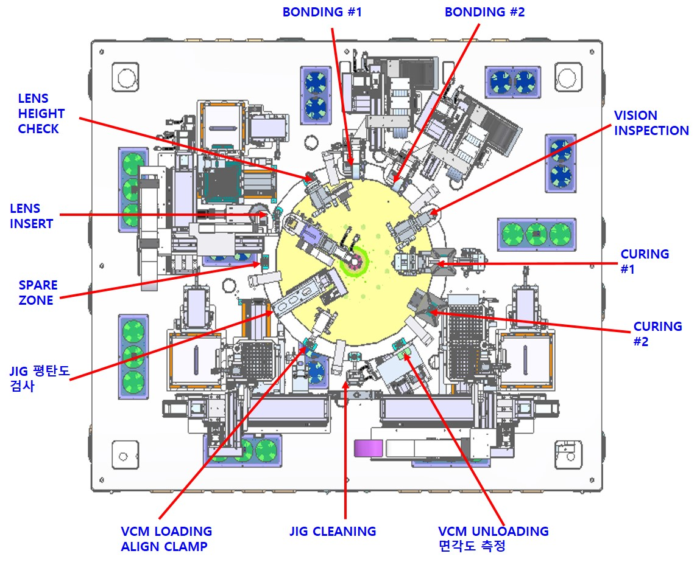

> OIS 렌즈채결기는 VCM에 렌즈를 조립, 본딩, UV 경화, 면각도 측정하는 장비로, Index Table과 총 31축의 제어 축이 사용되는 설비이다. 
> 장비의 대략적인 구동은 다음과 같이 이루어진다.
* VCM, Lens, Unload Magazine 트레이 투입
* 각 Unit 별 작업 시작 (E.g. Loading, Unloading, Check, Bonding, Curing)
* 모든 Unit의 작업 종료 후에 Index 회전
* 위의 과정 반복 시행, 자재 소진시 트레이 교환

## Main, Vision UI 주요 내용
> 이 부분에서는 UI의 모든 기능적 요소를 설명하는 것이 아닌 주요하게 여겨지는 부분을 중점으로 설명

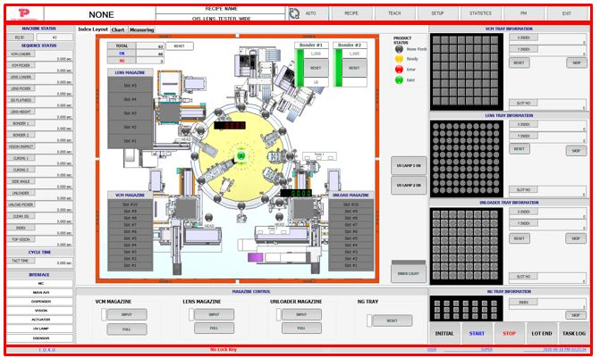

**Main UI - Auto - Interface**
> 컨트롤러의 연결 상태를 표시함.
> 
> MC: Main 전원 연결 상태 표시
> 
> Main Air: Main 공압 연결 상태 표시
> 
> Dispenser: 디스펜서 컨트롤러 연결 상태 표시
> 
> Vision: 카메라 연결 상태 표시
> 
> Actuator: K-Star 프로그램 연결 상태 표시
> 
> UV Lamp: UV 컨트롤러 연결 상태 표시
> 
> Dsensor: LensHeight 측정 센서 연결 상태 표시
> 
> 위의 상태들이 초록불이 들어온 것을 확인 후에 장비를 동작시켜야 한다. 
> 

**Main UI - Auto - 동작 제어 버튼**
> 장비의 Auto 모드에서의 동작을 제어한다.
>  
> Initial: 모터 원점 동작 버튼
> 
> Start: Auto 작업 시작 버튼
> 
> Stop: Auto 작업 정지 버튼
> 
> Lot End: 현재 Index에 올려진 자재만을 작업하는 경우 사용. VCM은 더 이상 투입하지 않고 Index에 들어가 있는 자재들만 작업한다.
> Auto 동작 중에 LOT END 버튼을 누르면 VCM Picker Unit은 멈추고 나머지 Unit은 작업을 합니다. 
> 
> Task Log: Log를 확인할 수 있는 창 팝업 버튼

**Main UI - Auto - Index Layout**
> 총 생산량, Ok Count, NG Count을 보여주며 Reset 버튼으로 초기화할 수 있다.
> 
> Index Zone의 작업 상태 표시는 다음과 같은 색깔로 표현된다.
> 
> 황색: 작업중, 녹색: 작업완료, 적색: NG
> 
> 중앙의 녹색 번호는 VCM Load 부분의 현재 Index 번호를 의미한다.

**Main UI - Recipe(General) - LensHeight Option**
> LensHeight 측정 결과로 OK/NG 판정 선택 가능하다.
> 
> 1. Lens Height: Lens 바닥에서 Lens Height 측정 센서의 Tool이 Lens에 닿는 위치까지의 실측 높이
> 
> 2. Allow Min/Max: 측정 판정 최소/최대 값 설정 파라미터
> 

**Main UI - Recipe(General) - Sequence Option**
> USE JIG FLATNESSL: 수동으로 Jig 평탄도 측정 시 선택 ***Auto 모드로 실행 시 반드시 미선택***
> 
> USE VISION: Epoxy 유/무 확인 Vision 기능 사용 시 선택 ***Epoxy Bond를 사용하지 않는다면 반드시 미선택***
> 

**Main UI - Recipe(General) - Dispenser Option**
> USE IDLE #1, #2: Bonder Unit을 장시간 사용하지 않을 때 사용 ***AUTO 동작 실행 시 사용금지***
> 
**Main UI - TEACH**
> 이 후의 내용에서 심도있게 다룰 것
> 간단히 설명하면, 각 장비들의 위치와 조건을 잡아주는 작업으로 VCM Loader, Lens Picker와 같은 장비들의 Tray 개수, Delay Time, Ready Position, Stage Position, Offset과 같은 값을 설정한다. 
> 각각의 장비들은 화살표를 클릭하여 제어하며, Jog 모드는 연속적인 움직임으로 Speed Control을 통해 속도를 제어한다. Relative 모드는 클릭마다 움직이며 움직일 거리를 입력하여 제어한다. 

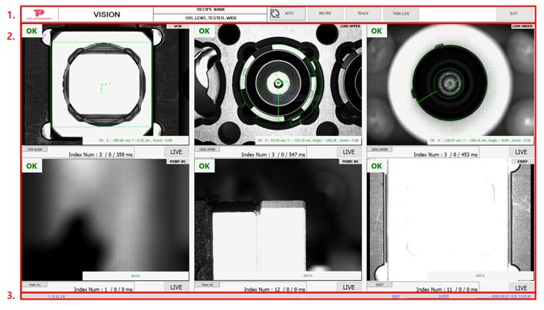

**Vision UI - Auto**
 * VCM TOP VISION: VCM TOP VISION (Lens Place를 위한 VCM Vision) Live/Grab 이미지
 * LENS UPPER: Lens Upper (Lens Pick을 위한 상부 카메라) Live/Grab 이미지
 * LENS UNDER: Lens Under (Lens Pick 후 Place를 위해 Picker 하부 확인을 위한 하부 카메라) Live/Grab 이미지
 * POINT #1: POINT #1 (Bonder #1 Jetting Position 확인을 위한 Bonder #1 카메라) Live/Grab 이미지
 * POINT #2: POINT #2 (Bonder #2 Jetting Position 확인을 위한 Bonder #2 카메라) Live/Grab 이미지
 * EXIST(Vision Inspect): Exist(Jetting 후 Jetting 유/무 판단 확인을 위한 Inspect 카메라) Live/Grab 이미지

## OIS 렌즈채결기 주요 Unit 소개
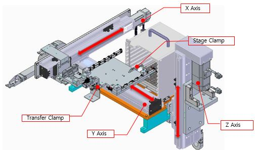

**VCM Loading**
> VCM Magazine에서 VCM Tray를 Clamping 하여 VCM Pickup 위치로 옮겨주는 Unit
> Unit의 구성은 Servo Motor(X, Y, Z Axis), Clamp으로 구성되며 동작은 다음과 같이 한다.
> 1) Transfer X Axis(Transfer Magazine Position X) 이동하여  VCM Magazine에서 VCM Tray Clamping
> 2) Transfer X Axis(Transfer Stage Position X) 이동하여 Stage Clamp 고정 및 Transfer Clamp 해제
> 3) Stage Y Axis(Stage First Pick Position Y) 이동하여 첫 번째 작업 위치로 이동

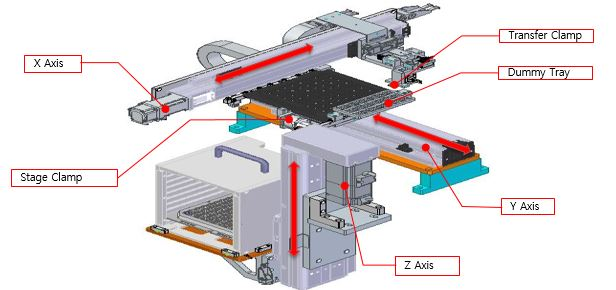

**VCM Unloading**
> Unload Magazine에서 Unload Tray를 Clamping하여 VCM Place 위치로 옮겨주는 Unit
> Unit의 구성은 Servo Motor(X, Y, Z Axis), Clamp, Dummy Tray으로 구성되며 동작은 다음과 같다.
> 1) Transfer X Axis(Transfer Magazine Position X) 이동하여 Unload Magazine에서 Unload Tray Clamping
> 2) Transfer X Axis(Transfer Stage Position X) 이동하여 Stage Clamp 고정 및 Transfer Clamp 해제
> 3) Stage Y Axis(Stage First Place Position Y) 이동하여 첫 번째 작업 위치로 이동

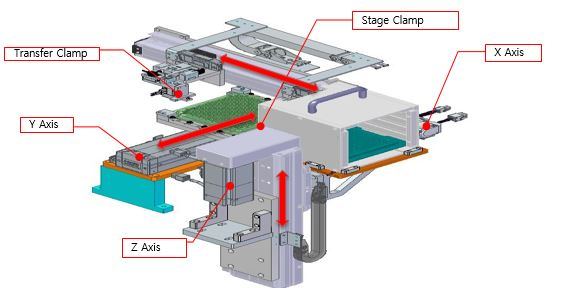

**Lens Loading**
> lens Magazine에서 Lens Tray를 Clamping 하여 Lens Pickup 위치로 옮겨주는 Unit
> Unit의 구성은 Servo Motor(X, Y, Z Axis), Clamp(Transfer, Stage)으로 구성되며 동작은 다음과 같다.
> 1) Transfer Y Axis(Transfer Magazine Position Y) 이동하여 Lens Magazine에서 Lens Tray Clamping
> 2) Transfer Y Axis(Transfer Stage Position Y) 이동하여 Stage Clamp 고정 및 Transfer Clamp 해제
> 3) Stage X Axis(Stage First Place Position X) 이동하여 첫 번째 작업 위치로 이동
> 

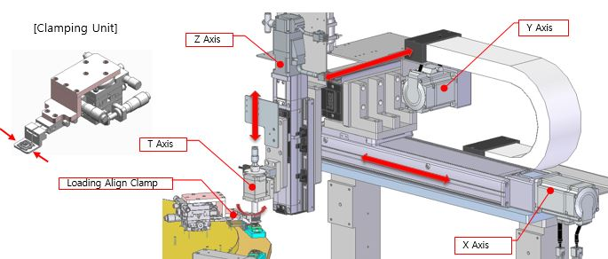

**VCM Picker**
> VCM Tray에서 VCM을 Pickup하여 Index 위에서 Clamping 후 Place하는 Unit
> Unit의 구성은 Servo Motor(X, Y, Z Axis), Step Motor(T Axis), Clamp(Loading Align Clamp)으로 구성되며 동작은 다음과 같다.
> 1) VCM Pickup 후 위치 이동 및 Theta 보정
> 2) Z축 Down 및 Clamping 동작으로 위치 보정
> 3) Index에 Place
> 

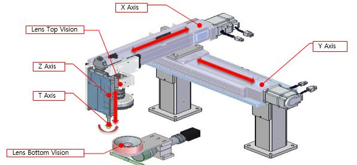

**Lens Picker**
> Lens Tray에서 Vision 인식 후 Lens를 Pickup 하여, Bottom Vision 위치 보정값과 VCM Vision 보정값을 연산하여 Index의 VCM에 Lens를 체결하는 Unit
> Unit의 구성은 Servo Motor(X, Y Axis), Linear Motor(Z, T Axis), Camera(Lens Top Vision 10M, Lens Bottom Vision 10M)으로 구성되며 동작은 다음과 같다.
> 1) Lens Tray에 Lens의 유무 확인 또는 Pickup을 위한 위치 보정값 측정 후 Theta 보정하여 Lens Pickup
> 2) Bottom Vision으로 Lens Insert 보정값 측저 및 VCM Vision 측정값과 연산하여 VCM에 Lens Insert
> 3) Lens Insert 시 설정된 Torque값보다 큰 값이 걸리면 Lens Vacuum 해제 및 Z축 상승

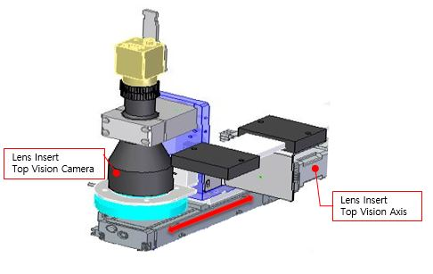

**VCM Vision**
> Jig Pocket에서 VCM 틀어짐 상태를 측정하는 Unit으로 Servo Motor(Lens Insert Top Vision Axis)와 Camera(VCM Vision 10M)으로 구성된다.
> Unit의 동작은 VCM Vision 측정 후 Ready 위치에서 대기하며 VCM의 역삽입 확인이 가능하다. 

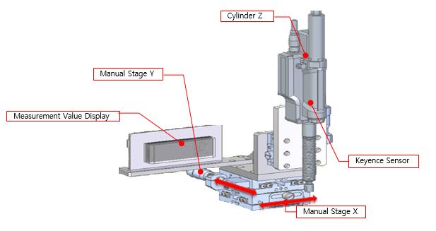

**Lens Height Measure**
> Lens Insert 높이 측정 Unit
> Unit의 구성은 Sensor(Keyence GT2, Display 앰프), Manual Stage(X, Y Axis), Cylinder(Z Axis)으로 구성되며 동작은 다음과 같다.
> 1) Insert 한 Lens의 높이를 측정하여 다음 공정 작업 가능 유무를 판단
> 2) Jig Pocket 교체 후 각 Index 별 높이 측정 및 Recipe 입력
> 

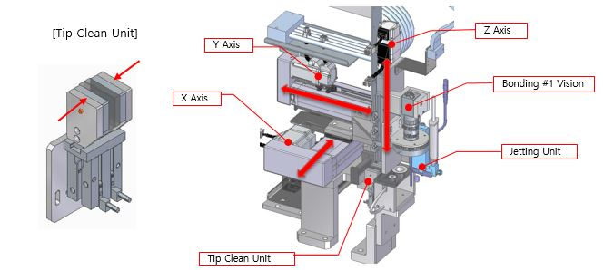

**Bonding**
> Lens Insert 후 정상 체결된 자재에 Epoxy 도포하는 Unit
> Unit의 구성은 Servo Motor(X, Y, Z Axis), Camera(Bonding# Vision 10M), Tip Clean Unit(Sponge, Cylinder)으로 구성되며 동작은 다음과 같다.
> 1) Vision으로 자재 Epoxy 도포 위치 보정 후 Recipe 입력된 패턴을 토대로 Epoxy 도포
> 2) 정해진 횟수 사용 후 Dummy 토출 또는 Tip Clean 동작 설정 가능

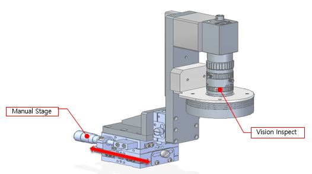

**Vision Inspect**
> Epoxy 도포 유무 검사하는 Unit으로 Manual Stage와 Camera(Vision Inspect 5M)으로 구성된다.
> 

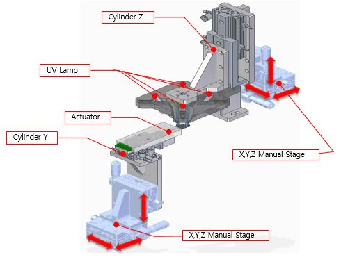

**UV Curing**
> Actuating 후 UV 경화하는 Unit
> Unit의 구성은 Manual Stage(UV unitL; X Y Z Axis, Actuator Unit; X Y Z Axis), UV Lamp(HOYA EXECURE4000), Cylinder(UV Unit; Z Axis, Actuator Unit; Y Axis), Actuator(K-Star CH1)으로 구성된다.

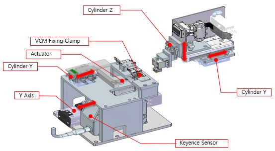

**Side Angle Measure**
> Index에서 VCM Pickup 후 Side Angle Jig에 Place 및 Side Angle 측정하는 Unit
> Unit의 구성은 Sensor(Keyence LJ-X8060), Cylinder(Actuator Unit; Y axis, Unloader Unit; Y axis), Clamp(VCM Fixing Clamp)), Actuator(K-Star CH2), Servo Motor(Y Axis)으로 구성된다.

## 이후에 정리될 내용 개괄
* 가능한 실제 장비 제어와 운용 관련한 내용 포함
* 각 unit 별 teach 과정에서의 방식과 사용되는 주요 값들의 설정 및 제어 방식 정리
* 실제 장비 제어 과정에서의 주요한 팁 

## Teach - 정리 이전에 주요 메모
### Bonding
> Bonder # Touch Position - 노즐이 터치센서에 위치하도록 설정하지만, 터치 센서에 직접 닿지 않게 해야한다. 터치 센서의 위치보다 약 3mm 정도 높게 설정한다.
> 
> Bonder # Touch Limit Z - 노즐의 터치 센서으로의 이동에 거리를 제한한다.
> 

 

